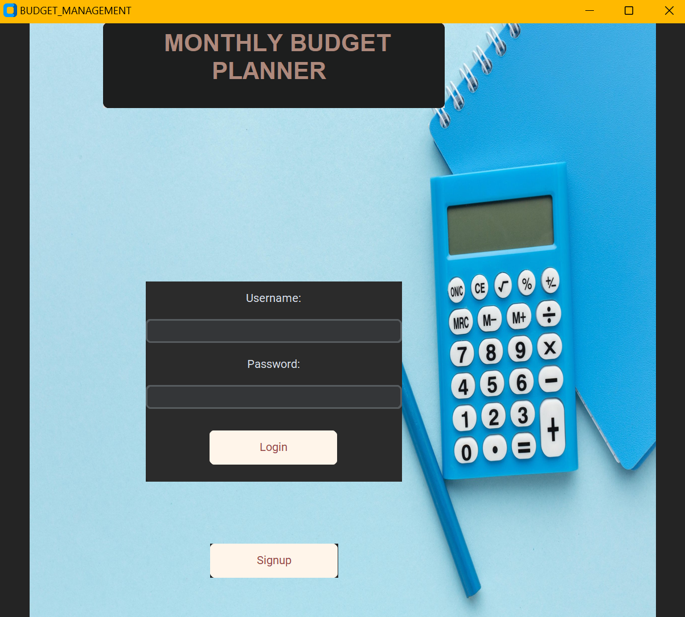
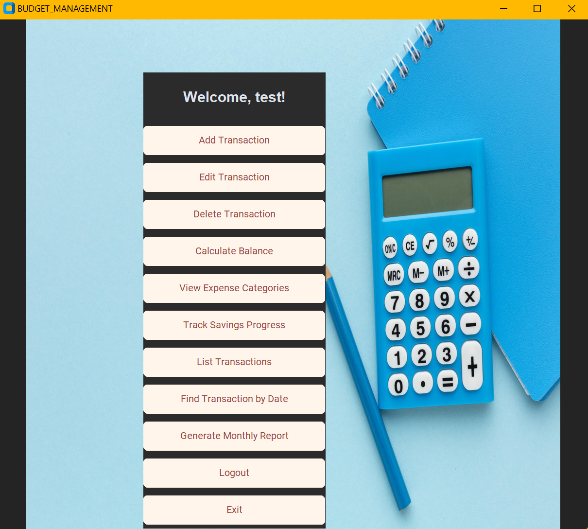
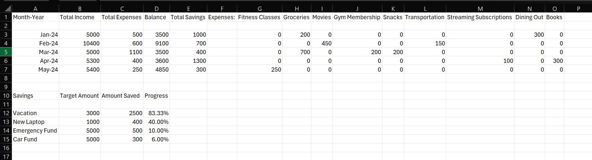

# Monthly Budget Management Application

The **Monthly Budget Management Application** is a GUI-based tool to help users effectively manage their monthly finances. It offers functionalities such as income and expense tracking, savings goal monitoring, category-wise analysis, and CSV report generation.

---

## Features

1. **Login and Signup System**:
   - Secure user authentication.
   - Persistent storage of user credentials using `pickle`.

2. **Transaction Management**:
   - Add, edit, delete, and list transactions.
   - Support for different transaction types: **Income**, **Expense**, and **Savings**.

3. **Category and Goal Analysis**:
   - View expense breakdown by category.
   - Track progress towards savings goals.

4. **Report Generation**:
   - Automatically generate monthly reports in CSV format.
   - Includes income, expenses, balance, savings, and category-wise expenses.

5. **Graphical User Interface (GUI)**:
   - Built with `CustomTkinter` for an intuitive and modern interface.

6. **Persistent Data**:
   - All user-specific data is saved and loaded automatically on login.

---

## Prerequisites

1. **Python 3.x**
2. **Pip (Python Package Manager)**

### Installation Steps

1. Clone the repository:
   ```bash
   git clone <repository-link>
   cd MonthlyBudgetManagement
   ```

2. Install the required libraries:
   ```bash
   pip install customtkinter pillow
   ```

3. Run the application:
   ```bash
   python main.py
   ```

---

## Supported Operating Systems

- Windows
- Linux
- macOS

---

## Libraries and Modules Used

1, **TKinter**:
   - For creating main app design.
2. **CustomTkinter**:
   - For creating a modern and intuitive GUI.
3. **Pillow**:
   - For image handling and display in the GUI.
4. **Pickle**:
   - For data serialization and persistent storage.
5. **CSV**:
   - To save and manage transaction reports.
6. **Calendar**:
   - To sort months in logical order for reports.
7. **OS**
   - For functionalities with file handling

---

## Classes and Modules Overview

### Classes
1. **Transaction**:
   - Base class representing a financial transaction.
2. **Income**:
   - Subclass of `Transaction` for income-specific attributes like `source`.
3. **Expense**:
   - Subclass of `Transaction` for expense-specific attributes like `expense_type`.
4. **Savings**:
   - Subclass of `Transaction` for savings-specific attributes like `goal` and `target_amount`.

### Modules
1. **`main.py`**:
   - Entry point of the application.
   - Handles login/signup and main menu interactions.

2. **`budget_logic.py`**:
   - Implements transaction management operations (add, edit, delete, view).

3. **`report_generator.py`**:
   - Handles monthly report generation and saving to CSV files.

4. **`transaction.py`**:
   - Defines the `Transaction` class and its subclasses (`Income`, `Expense`, `Savings`).

---

## How to Use

### 1. **Login/Signup**
- **Signup**: Create a new account by providing a username and password.
- **Login**: Enter your credentials to access the application.

### 2. **Add Transactions**
- Select the transaction type (**Income**, **Expense**, or **Savings**).
- Fill in the relevant details and save the transaction.

### 3. **View and Edit Transactions**
- List all transactions and filter by date.
- Edit or delete specific transactions.

### 4. **Generate Monthly Reports**
- Automatically saves a detailed CSV report for each month.
- Includes total income, expenses, balance, savings, and category-wise expenses.

---

## Team Contributions

- Lohith:
  - Integrated backend functionalities with the frontend, ensuring seamless feature execution.
  - Managed user authentication by implementing the login and signup systems.

- Kapish:
  - Developed the graphical user interface (GUI) using CustomTkinter to enhance user experience.
  - Conducted rigorous testing to identify edge cases and ensure robust program behavior.

- Navya:
  - Implemented the logic for report generation and exporting data to CSV files.
  - Developed pickling mechanisms to enable persistent storage of objects.

- Sparsh:
  - Designed and implemented the Transaction class along with its subclasses (Income, Expense, Savings).
  - Contributed to the development of core budget management functionalities.

- Akshat:
  - Developed advanced budget logic and ensured proper integration of all application components.
  - Conducted extensive testing to ensure platform compatibility and overall system stability.

---

## Screenshots

### 1. Login Screen


### 2. Main Dashboard


### 3. Monthly Report CSV


---

## Known Issues and Future Enhancements

- **Known Issues**:
  - None reported.

- **Future Enhancements**:
  - Add graphical analysis (e.g., bar and pie charts) for reports.
  - Support for additional currencies and categories.
  - Enable multi-user collaboration for shared budgets.

---